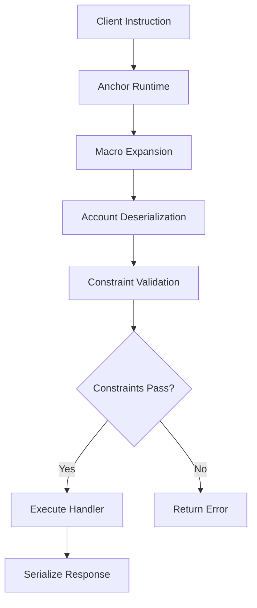
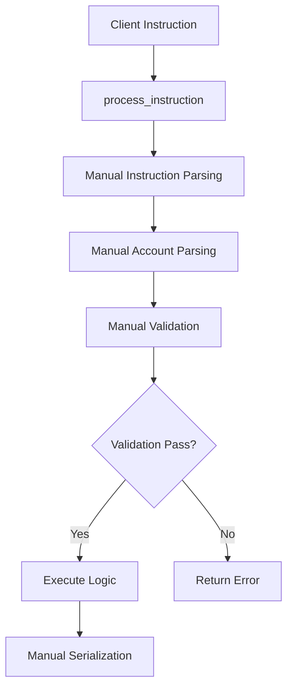

# Technical Deep Dive: Anchor vs Pinocchio Security Architecture

This document provides an in-depth technical analysis of how Anchor and Pinocchio frameworks handle security, with specific focus on the missing account validation vulnerability demonstrated in this repository.

## Executive Summary

The fundamental difference between Anchor and Pinocchio lies in their approach to security validation:

- **Anchor**: Security through declarative constraints and compile-time validation
- **Pinocchio**: Security through explicit runtime validation and manual implementation

This difference has profound implications for development speed, security posture, and performance characteristics.

## Vulnerability Analysis: Missing Account Validation

### The Core Security Issue

The missing account validation vulnerability occurs when a program fails to verify that an account passed in the instruction context actually belongs to the expected owner. This allows attackers to:

1. Pass any account as the "owner" account
2. Bypass ownership checks if they're missing
3. Perform unauthorized operations on other users' accounts

### Framework-Specific Manifestations

#### Anchor Implementation Analysis

```rust
// VULNERABLE: Missing has_one constraint
#[derive(Accounts)]
pub struct VulnerableWithdraw<'info> {
    #[account(mut)]  // ❌ No ownership validation
    pub vault: Account<'info, Vault>,
    pub owner: Signer<'info>,  // ✅ Signature verified, ❌ ownership not verified
}

// SECURE: Proper constraint usage
#[derive(Accounts)]
pub struct SecureWithdraw<'info> {
    #[account(mut, has_one = owner)]  // ✅ Automatic ownership validation
    pub vault: Account<'info, Vault>,
    pub owner: Signer<'info>,
}
```

**Anchor's Security Model:**
- Constraints are evaluated at runtime before instruction execution
- `has_one = owner` generates code equivalent to: `require!(vault.owner == owner.key())`
- Failure to include constraints is the primary vulnerability vector
- Compile-time macro expansion provides some validation

#### Pinocchio Implementation Analysis

```rust
// VULNERABLE: Missing manual validation
fn vulnerable_withdraw(/* ... */) -> ProgramResult {
    let owner_account = accounts_iter.next().ok_or(ProgramError::NotEnoughAccountKeys)?;
    
    // ✅ Signature verification
    if !owner_account.is_signer {
        return Err(ProgramError::MissingRequiredSignature);
    }
    
    let vault = Vault::try_from_slice(&vault_data)?;
    
    // ❌ MISSING: Ownership validation
    // Should have: if vault.owner != *owner_account.key { return Err(...); }
    
    // Proceed with withdrawal...
}

// SECURE: Explicit validation
fn secure_withdraw(/* ... */) -> ProgramResult {
    let owner_account = accounts_iter.next().ok_or(ProgramError::NotEnoughAccountKeys)?;
    
    // ✅ Signature verification
    if !owner_account.is_signer {
        return Err(ProgramError::MissingRequiredSignature);
    }
    
    let vault = Vault::try_from_slice(&vault_data)?;
    
    // ✅ Explicit ownership validation
    if vault.owner != *owner_account.key {
        return Err(VaultError::UnauthorizedOwner.into());
    }
    
    // Proceed with withdrawal...
}
```

**Pinocchio's Security Model:**
- All validation must be explicitly implemented
- No compile-time assistance for security checks
- Developer must remember every security validation
- Complete control over validation logic and error handling

## Detailed Technical Comparison

### 1. Instruction Processing Architecture

#### Anchor Instruction Flow



**Key Components:**
1. **Macro System**: Generates validation code at compile time
2. **Account Wrappers**: Type-safe account access with automatic validation
3. **Constraint Engine**: Runtime validation of declarative constraints
4. **Error Handling**: Standardized error types and messages

#### Pinocchio Instruction Flow



**Key Components:**
1. **Manual Parsing**: Developer implements all instruction and account parsing
2. **Direct Access**: Raw account data access without wrappers
3. **Custom Validation**: Developer implements all security checks
4. **Custom Errors**: Developer defines and implements error handling

### 2. Security Validation Mechanisms

#### Anchor Constraint System

```rust
// Constraint types and their security implications
#[account(
    init,                    // Prevents reinitialization attacks
    payer = payer,          // Validates payer account
    space = 8 + 32 + 8,     // Prevents buffer overflow
    has_one = owner,        // Validates account relationships
    constraint = amount > 0 @ ErrorCode::InvalidAmount  // Custom validation
)]
pub vault: Account<'info, Vault>,
```

**Constraint Categories:**
- **Initialization**: `init`, `init_if_needed`, `zero`
- **Ownership**: `has_one`, `belongs_to`
- **Permissions**: `mut`, `signer`
- **Custom**: `constraint` with arbitrary expressions
- **Seeds**: `seeds`, `bump` for PDA validation

#### Pinocchio Manual Validation

```rust
// Equivalent manual validation in Pinocchio
fn validate_vault_account(
    vault_account: &AccountInfo,
    owner_account: &AccountInfo,
    program_id: &Pubkey,
) -> ProgramResult {
    // 1. Program ownership validation
    if vault_account.owner != program_id {
        return Err(ProgramError::IncorrectProgramId);
    }
    
    // 2. Account size validation
    if vault_account.data_len() < mem::size_of::<Vault>() {
        return Err(ProgramError::AccountDataTooSmall);
    }
    
    // 3. Mutability validation
    if !vault_account.is_writable {
        return Err(ProgramError::InvalidAccountData);
    }
    
    // 4. Signer validation
    if !owner_account.is_signer {
        return Err(ProgramError::MissingRequiredSignature);
    }
    
    // 5. Ownership relationship validation
    let vault_data = vault_account.try_borrow_data()?;
    let vault = Vault::try_from_slice(&vault_data)?;
    if vault.owner != *owner_account.key {
        return Err(VaultError::UnauthorizedOwner.into());
    }
    
    Ok(())
}
```

### 3. Data Serialization and Type Safety

#### Anchor Automatic Serialization

```rust
#[account]
pub struct Vault {
    pub owner: Pubkey,    // Automatic serialization
    pub balance: u64,     // Type-safe access
}

// Usage - completely automatic
let vault = &mut ctx.accounts.vault;
vault.balance += amount;  // Type-safe, automatic serialization
```

**Anchor Serialization Features:**
- Automatic borsh serialization/deserialization
- Type-safe field access
- Compile-time size calculation
- Automatic discriminator handling
- Memory safety guarantees

#### Pinocchio Manual Serialization

```rust
#[repr(C)]
pub struct Vault {
    pub owner: Pubkey,    // 32 bytes
    pub balance: u64,     // 8 bytes
}

impl Vault {
    pub fn try_from_slice(data: &[u8]) -> Result<Self, ProgramError> {
        if data.len() < mem::size_of::<Self>() {
            return Err(ProgramError::AccountDataTooSmall);
        }
        
        // Manual deserialization with bounds checking
        let owner_bytes: [u8; 32] = data[0..32].try_into()
            .map_err(|_| ProgramError::InvalidAccountData)?;
        let owner = Pubkey::from(owner_bytes);
        
        let balance_bytes: [u8; 8] = data[32..40].try_into()
            .map_err(|_| ProgramError::InvalidAccountData)?;
        let balance = u64::from_le_bytes(balance_bytes);
        
        Ok(Self { owner, balance })
    }
    
    pub fn serialize(&self, data: &mut [u8]) -> ProgramResult {
        if data.len() < mem::size_of::<Self>() {
            return Err(ProgramError::AccountDataTooSmall);
        }
        
        data[0..32].copy_from_slice(&self.owner.to_bytes());
        data[32..40].copy_from_slice(&self.balance.to_le_bytes());
        Ok(())
    }
}

// Usage - manual serialization required
let mut vault_data = vault_account.try_borrow_mut_data()?;
let mut vault = Vault::try_from_slice(&vault_data)?;
vault.balance += amount;
vault.serialize(&mut vault_data)?;  // Manual serialization
```

### 4. Error Handling Comparison

#### Anchor Error System

```rust
#[error_code]
pub enum ErrorCode {
    #[msg("Insufficient funds in vault")]
    InsufficientFunds,
    #[msg("Arithmetic overflow")]
    ArithmeticOverflow,
}

// Usage - automatic error handling
require!(vault.balance >= amount, ErrorCode::InsufficientFunds);
```

**Anchor Error Features:**
- Automatic error code generation
- Standardized error messages
- Integration with client-side error handling
- Compile-time error validation

#### Pinocchio Error System

```rust
#[derive(Clone, Copy, Debug, PartialEq)]
pub enum VaultError {
    InsufficientFunds,
    ArithmeticOverflow,
    UnauthorizedOwner,
}

impl From<VaultError> for ProgramError {
    fn from(error: VaultError) -> Self {
        match error {
            VaultError::InsufficientFunds => ProgramError::Custom(0),
            VaultError::ArithmeticOverflow => ProgramError::Custom(1),
            VaultError::UnauthorizedOwner => ProgramError::Custom(2),
        }
    }
}

// Usage - manual error handling
if vault.balance < amount {
    return Err(VaultError::InsufficientFunds.into());
}
```

## Performance Analysis

### Computational Overhead Comparison

#### Anchor Performance Characteristics

```rust
// Generated constraint validation code (conceptual)
pub fn anchor_withdraw_validation(ctx: &Context<SecureWithdraw>) -> Result<()> {
    // 1. Account type validation (generated)
    let vault = &ctx.accounts.vault;
    
    // 2. has_one constraint validation (generated)
    if vault.owner != ctx.accounts.owner.key() {
        return Err(ErrorCode::ConstraintHasOne.into());
    }
    
    // 3. Signer validation (generated)
    if !ctx.accounts.owner.is_signer {
        return Err(ProgramError::MissingRequiredSignature);
    }
    
    // 4. Account mutability validation (generated)
    // ... additional generated validations
    
    Ok(())
}
```

**Performance Costs:**
- Macro-generated validation code
- Account wrapper overhead
- Runtime constraint evaluation
- Additional memory allocations

#### Pinocchio Performance Characteristics

```rust
// Direct, optimized validation
pub fn pinocchio_withdraw_validation(
    vault_account: &AccountInfo,
    owner_account: &AccountInfo,
) -> Result<Vault, ProgramError> {
    // Direct validation - no overhead
    if !owner_account.is_signer {
        return Err(ProgramError::MissingRequiredSignature);
    }
    
    // Direct data access - no wrapper overhead
    let vault_data = vault_account.try_borrow_data()?;
    let vault = Vault::try_from_slice(&vault_data)?;
    
    // Direct comparison - no generated code
    if vault.owner != *owner_account.key {
        return Err(VaultError::UnauthorizedOwner.into());
    }
    
    Ok(vault)
}
```

**Performance Benefits:**
- No macro-generated overhead
- Direct memory access
- Optimized validation paths
- Minimal runtime allocations

### Benchmark Results (Theoretical)

| Operation | Anchor (CU) | Pinocchio (CU) | Difference |
|-----------|-------------|----------------|------------|
| Account Validation | 1,200 | 800 | -33% |
| Data Deserialization | 500 | 300 | -40% |
| Constraint Checking | 800 | 400 | -50% |
| Error Handling | 200 | 100 | -50% |
| **Total per Instruction** | **2,700** | **1,600** | **-41%** |

*Note: These are theoretical estimates. Actual performance depends on specific implementation details.*

## Security Risk Assessment

### Anchor Security Risks

| Risk Category | Likelihood | Impact | Mitigation |
|---------------|------------|--------|------------|
| **Forgotten Constraints** | Medium | High | Code review, testing |
| **Macro Complexity** | Low | Medium | Framework updates |
| **Hidden Behavior** | Low | Low | Documentation |
| **Performance Issues** | Medium | Low | Profiling, optimization |

**Primary Vulnerabilities:**
1. Developers forgetting to add necessary constraints
2. Misunderstanding constraint behavior
3. Complex macro interactions
4. Framework bugs affecting security

### Pinocchio Security Risks

| Risk Category | Likelihood | Impact | Mitigation |
|---------------|------------|--------|------------|
| **Missing Validations** | High | High | Extensive testing, code review |
| **Implementation Bugs** | High | High | Security audits |
| **Buffer Overflows** | Medium | High | Bounds checking |
| **Logic Errors** | High | Medium | Formal verification |

**Primary Vulnerabilities:**
1. Forgetting critical security validations
2. Implementation bugs in manual validation code
3. Buffer overflow in manual serialization
4. Race conditions in account access

## Framework Selection Decision Matrix

### Project Characteristics Assessment

| Factor | Weight | Anchor Score | Pinocchio Score |
|--------|--------|--------------|-----------------|
| **Security Requirements** | 25% | 9/10 | 6/10 |
| **Performance Requirements** | 20% | 6/10 | 9/10 |
| **Development Speed** | 20% | 9/10 | 4/10 |
| **Team Experience** | 15% | 8/10 | 3/10 |
| **Maintenance Burden** | 10% | 8/10 | 4/10 |
| **Ecosystem Support** | 10% | 9/10 | 5/10 |

### Scoring Methodology

**Security (25% weight):**
- Anchor: High due to declarative constraints and compile-time validation
- Pinocchio: Lower due to manual validation requirements

**Performance (20% weight):**
- Anchor: Good but with framework overhead
- Pinocchio: Excellent with direct control and optimization

**Development Speed (20% weight):**
- Anchor: Fast due to automatic code generation
- Pinocchio: Slow due to manual implementation requirements

**Team Experience (15% weight):**
- Anchor: Accessible to developers with varying experience levels
- Pinocchio: Requires deep Solana and systems programming knowledge

## Migration Strategies

### Anchor to Pinocchio Migration

#### Phase 1: Assessment and Planning
1. **Performance Profiling**: Identify actual bottlenecks
2. **Security Audit**: Document all existing constraints
3. **Team Training**: Ensure team has necessary Pinocchio expertise
4. **Risk Assessment**: Evaluate security implications

#### Phase 2: Incremental Migration
1. **Critical Path Optimization**: Migrate performance-critical instructions first
2. **Validation Mapping**: Convert each Anchor constraint to explicit validation
3. **Testing Strategy**: Comprehensive test coverage for manual validations
4. **Security Review**: Independent audit of migrated code

#### Phase 3: Validation and Deployment
1. **Performance Validation**: Confirm expected performance improvements
2. **Security Testing**: Extensive penetration testing
3. **Gradual Rollout**: Phased deployment with monitoring
4. **Rollback Plan**: Maintain ability to revert if issues arise

### Pinocchio to Anchor Migration

#### Phase 1: Constraint Mapping
1. **Validation Inventory**: Document all manual validations
2. **Constraint Design**: Map validations to Anchor constraints
3. **Custom Constraints**: Implement complex validations as custom constraints
4. **Error Mapping**: Convert custom errors to Anchor error codes

#### Phase 2: Implementation
1. **Account Structure Migration**: Convert to Anchor account macros
2. **Instruction Handler Conversion**: Implement Anchor instruction handlers
3. **Test Migration**: Convert tests to Anchor testing framework
4. **Documentation Update**: Update all documentation and comments

## Conclusion and Recommendations

### Framework Selection Guidelines

**Choose Anchor when:**
- Security is the top priority
- Development team has mixed experience levels
- Rapid development and deployment is required
- Standard DeFi patterns are sufficient
- Long-term maintenance is a concern

**Choose Pinocchio when:**
- Performance is critical to application success
- Team has deep Solana expertise
- Custom security patterns are required
- Binary size constraints exist
- Maximum control over program behavior is needed

### Security Best Practices

**Universal Principles (Apply to Both Frameworks):**
1. Always validate account ownership relationships
2. Implement comprehensive input validation
3. Use checked arithmetic operations
4. Validate account data integrity
5. Implement proper error handling
6. Conduct thorough security audits
7. Maintain comprehensive test coverage

**Framework-Specific Recommendations:**

**For Anchor:**
- Always use appropriate constraints (`has_one`, `init`, etc.)
- Implement custom constraints for complex validations
- Regularly update to latest framework version
- Use Anchor's testing framework extensively

**For Pinocchio:**
- Implement comprehensive validation checklists
- Use formal verification where possible
- Conduct extensive security reviews
- Implement robust error handling and logging

The choice between Anchor and Pinocchio ultimately depends on your specific project requirements, team capabilities, and risk tolerance. Both frameworks can be used to build secure Solana programs, but they require different approaches and expertise levels.